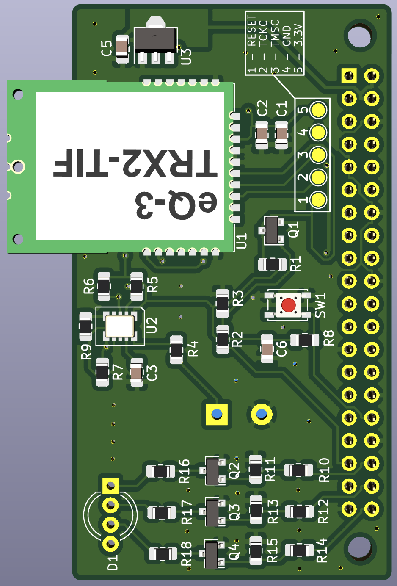
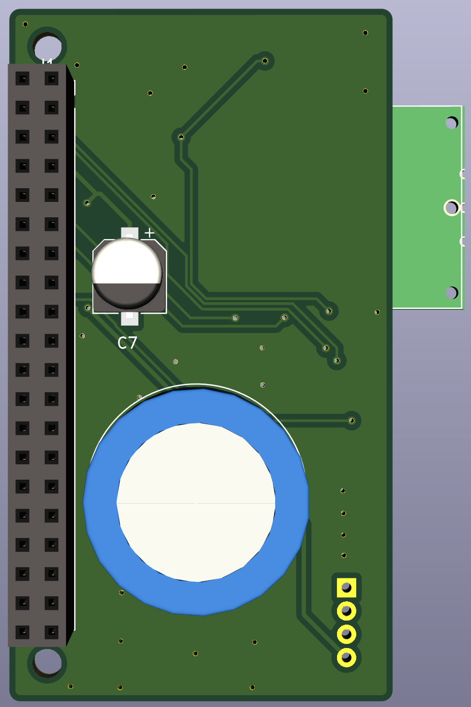
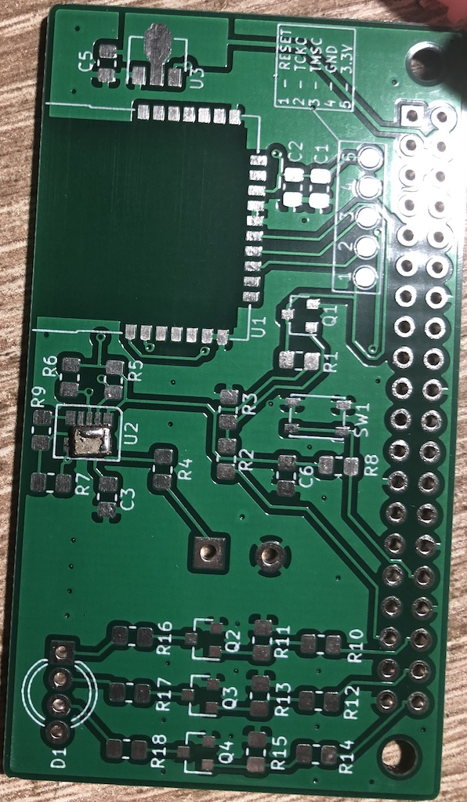
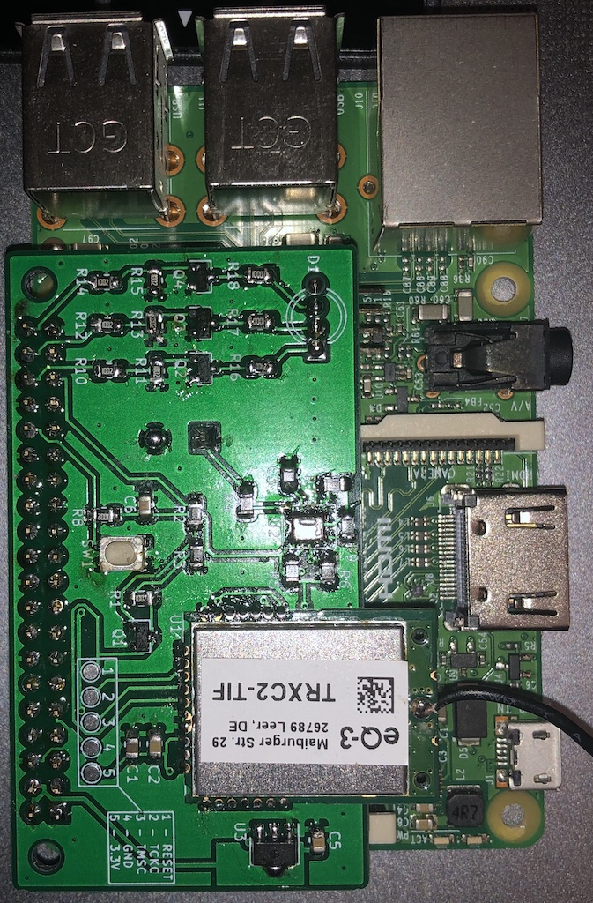
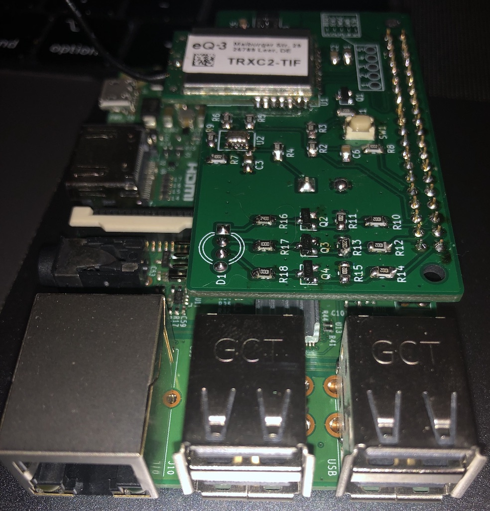
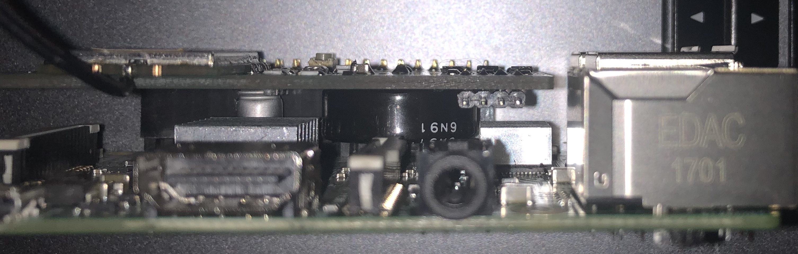
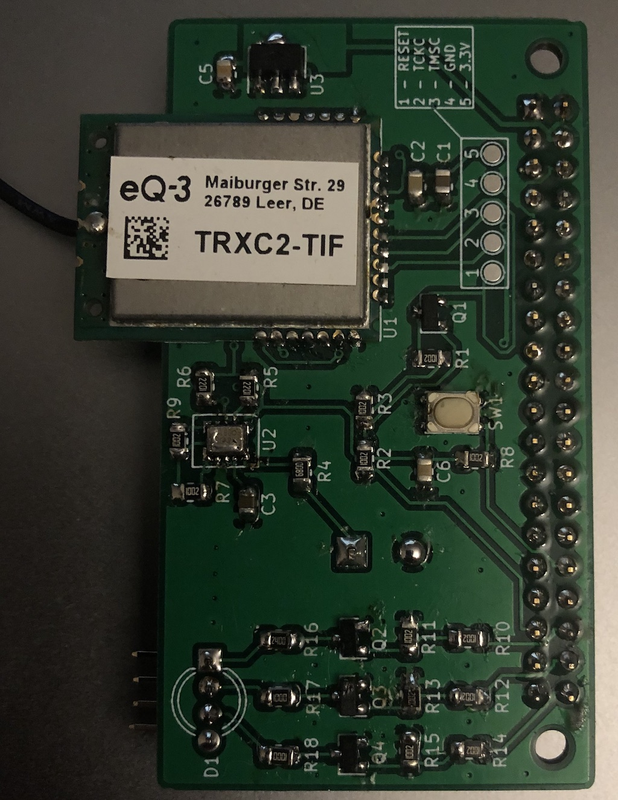
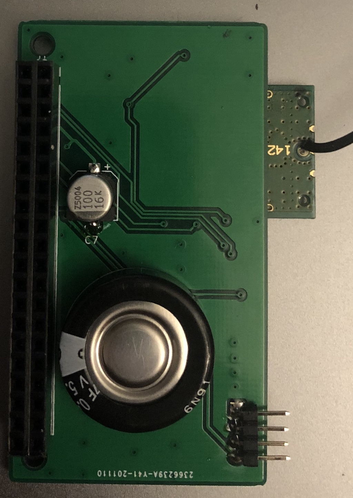
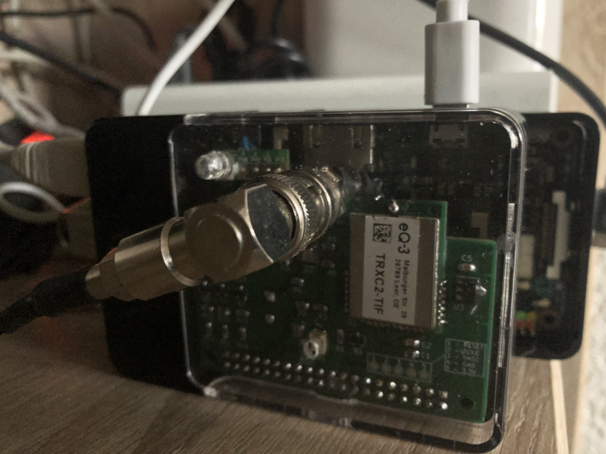

# HB-RF-MOD
Alternative Platine zum RPI-RF-MOD, um das Funkmodul "richtig herum" auf den Raspberry Pi aufsetzen zu können.

**19.11.2020 - die Platinen sind da**  

  
**20.11.2020 - erster Aufbau und voller Erfolg!** :tada:  
 

 

 

**21.11.2020 - Inbetriebnahme** 

