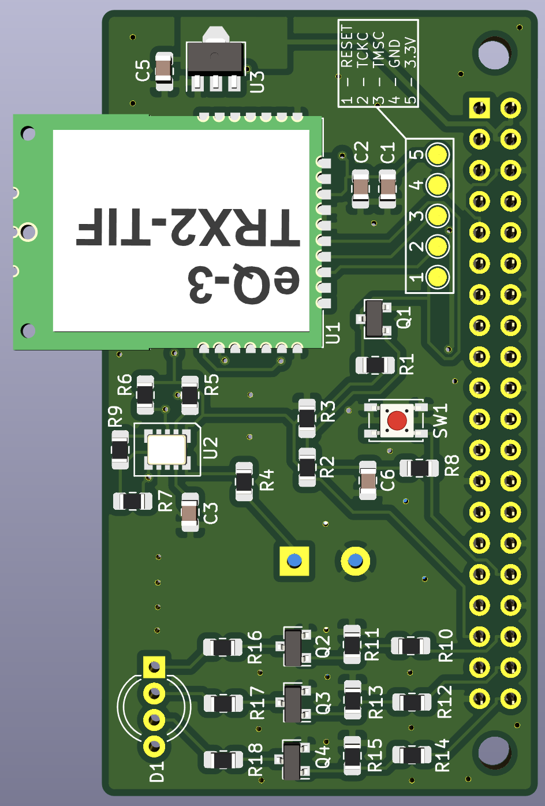

# HB-RF-MOD
Alternative Platine zum RPI-RF-MOD, um das Funkmodul "richtig herum" auf den Raspberry Pi aufsetzen zu können.

### :construction: Work in progress

**:warning:Die Schaltung befindet sich noch in der Entwicklung. :arrow_right:Die hier abgelegten Dateien (insbesondere Gerber) sind noch ungetestet!**

